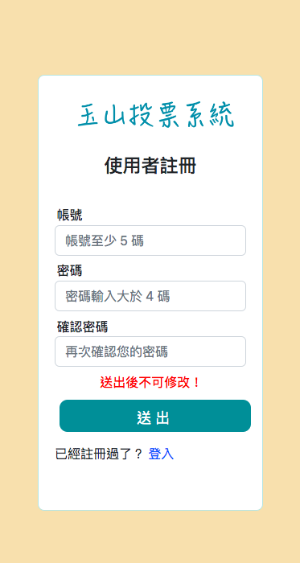
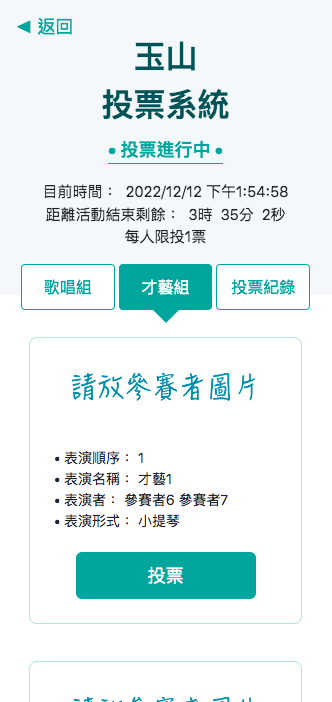
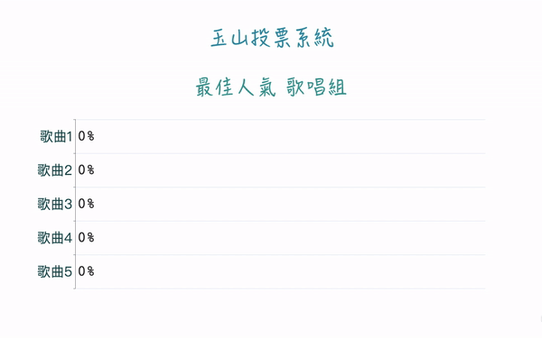
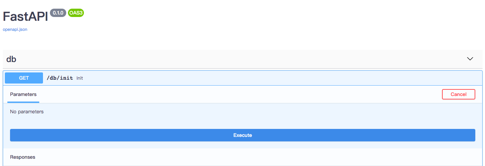
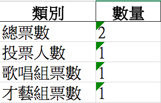

<p align="center">
  <a href="./README.md"> English </a> | <a href="./README.zh-TW.md"> 繁體中文

  <p align="center">
  <target="_blank">
    
  </a>
</p>
  
<p align="center">
  Developed by E.SUN COMMERCIAL BANK, LTD.<br></a>
<br>

</p>


[](https://www.gnu.org/licenses/lgpl-2.1)
[](https://www.python.org/downloads/release/python-370/)
<div>
  
  
  
  
  
</div>

# Voting System

This system is a voting system that enables people who want to organize events and count votes to create and use voting services.

## Summary

- This system uses various Google Cloud Platform components, including VM instances and Cloud SQL, to be built.
- The front-end and back-end of this system are separated, with the front-end using Vue, the back-end using FastAPI, load balancing using NGINX, and the database using Postgres. All services can be enabled using Docker Compose.

## Features Display

### Login / Register / Menu / Prepare

<div>
  
  
  
  
</div>


### Voting interface
Supports the function of one or more votes.

<div>
  
  
  
</div>

### Dynamic graph of vote counting results


## Prerequisites
- You will need Docker, and it is recommended to use Docker Desktop. Docker can be used to start all services directly on your local machine.
- You can configure GCP machines according to the system architecture diagram.

## System Architecture


## Getting Started

1. Run Development Mode with Docker
```
# Launch the dev mode
docker-compose -f ./docker-compose-dev.yml up -d

# Stop the dev mode
docker-compose -f ./docker-compose-dev.yml down
```


2. Enter [localhost:5000/docs](http://localhost:5000/docs#/) in the browser URL to open the API file.


3. Execute `/db/init` to initialize the DB through the API file.


4. Enter [localhost](http://localhost/) in the browser URL to open the front-end webpage.

5. The default username is "admin" and the default password is "12345678". You can also click the registration page to register a new account.

## System Description

### Frontend


### Backend

#### db
- `/db/init`：The data table can be created, and this step must be performed before use.


#### time
- `/time/change`：It is used to change the time of the voting checkpoint. The frontend will display "Voting in progress", "Voting has not yet started", and "Voting has ended".

#### login
- `/login`：login function.

#### teams
- `/teams/get_menu`：Get team information according to gid.

#### vote
- `/vote/now`：Take the server time, datetime.now is the GMT time in the Taiwan time zone, and send it back to the front end through timedelta + 8 hours.
- `/vote/who`：query who to vote for
- `/vote/vote`：Used for voting, adding token can increase security.
- `/vote/race`：Provides calculations for counting votes.
- `/vote/race/sing`：Provides calculations for counting votes (Fake Data).
- `/vote/race/talent`：Provides calculations for counting votes (Fake Data).
- `/vote/delete`：delete the vote
- `/vote/download`：Download the voting results of each group and calculate the number of votes for each group.


- `/vote/download2`：Download the voting overview, including calculating the total number of votes, the number of voters, the number of votes for the singing group, and the number of votes for the talent group.


- `/vote/count`：Calculate the number of votes, which can be used to make a bar graph (You can implement the function of viewing the bar graph during the voting process).

### DataBase

#### Schemas


#### Connect to DB
1. docker exec -it {postgres CONTAINER ID} /bin/sh
2. psql -U postgres

## Deploy on Production
1. Set up the load balancer. For related settings, please refer to the load_balance folder.
2. Build the front-end for the production environment. Run the command. ```npm run build```
3. Use NGINX to serve the front-end page, and the directory is set in the front-end's dist folder.
4. The backend can set one or more IP locations according to your usage.
5. Set up Cloud SQL.
6. When using ```docker-compose -f ./docker-compose.yml up``` to create a container, remember to adjust the `SQLALCHEMY_DATABASE_URL` setting in the backend to the IP of Cloud SQL, and adjust `axios.defaults.baseURL` in the frontend to avoid CORS errors.

## License
Copyright (C) 2023  E.SUN BANK.

This program is free software: you can redistribute it and/or modify it under the terms of the GNU General Public License as published by the Free Software Foundation, either version 2.1 of the License, or (at your option) any later version.

This program is distributed in the hope that it will be useful,but WITHOUT ANY WARRANTY; without even the implied warranty of MERCHANTABILITY or FITNESS FOR A PARTICULAR PURPOSE.  See the GNU General Public License for more details.


