<p align="center">
  <a href="./README.md"> English </a> | <a href="./README.zh-TW.md"> 繁體中文

  <p align="center">
  <target="_blank">
    
  </a>
</p>
  
<p align="center">
  玉山商業銀行股份有限公司開發<br></a>
<br>

</p>


[](https://www.gnu.org/licenses/lgpl-2.1)
[](https://www.python.org/downloads/release/python-370/)
<div>
  
  
  
  
  
</div>

# Voting System

這是個投票系統，讓想舉辦活動並統計投票的人，可以利用此系統建立投票相關服務。

## 系統概要

- 本系統需使用 Google Cloud Platform 相關元件完成建置。包含 VM instances、Cloud SQL 等。
- 本系統前後端分離，前端 Vue、後端 FastAPI、負載平衡 NGINX、資料庫 Postgres，而所有服務可以由 Docker Compose 啟用。

## 功能展示
### 登入 / 註冊 / 選單 / 準備頁

<div>
  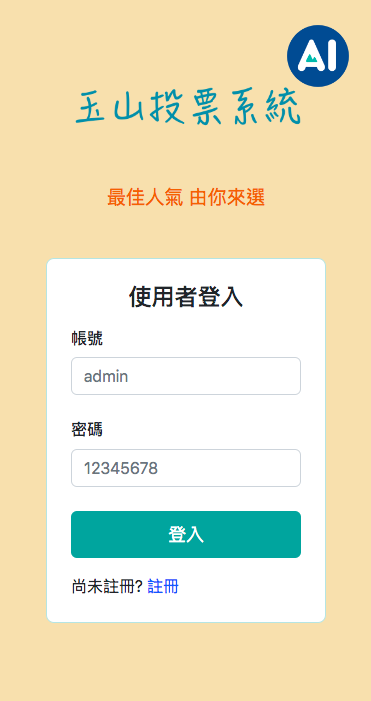
  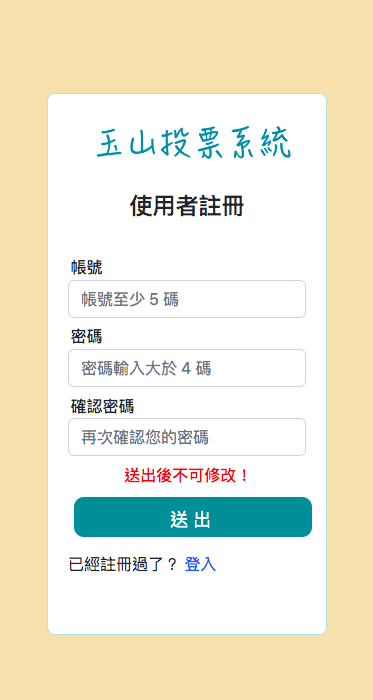
  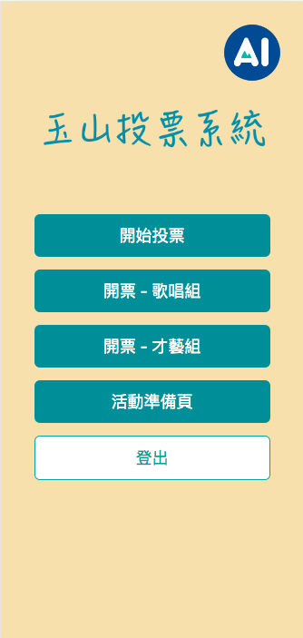
  
</div>


### 投票介面
支援一票或多票的功能。

<div>
  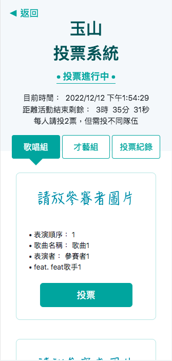
  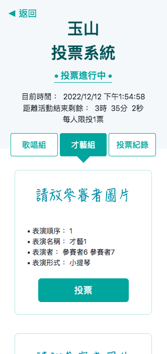
  
</div>

### 開票結果動態圖
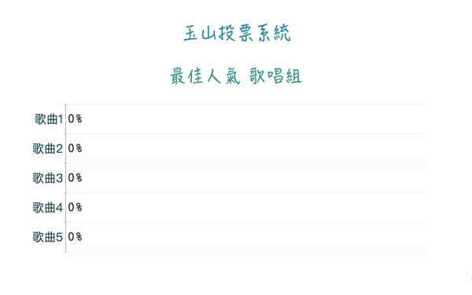

## 前置作業
- 須有 docker，建議可用 Docker Desktop。您可以於本機直接使用 Docker Compose 啟動所有的服務。
- 您可以依照系統架構圖設定 GCP 機器。

## 系統架構
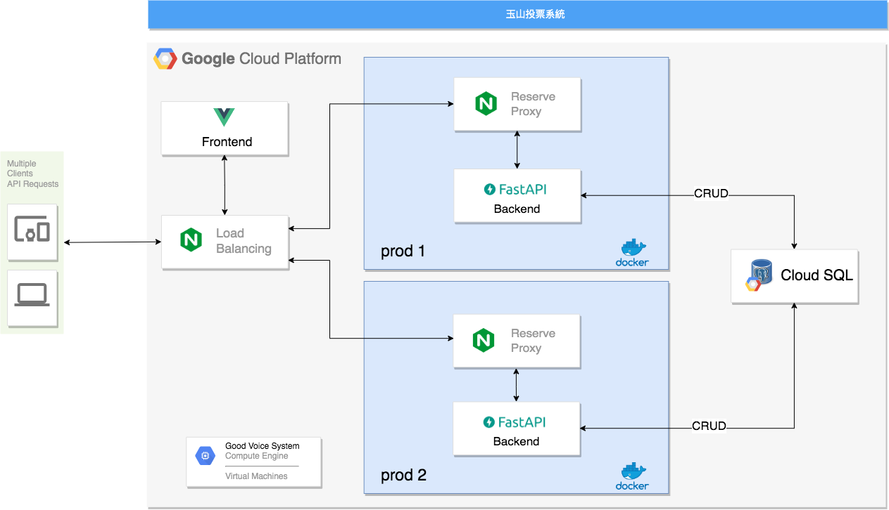


## 快速開始

1. 啟動開發環境的容器
```
# Launch the dev mode
docker-compose -f ./docker-compose-dev.yml up -d

# Stop the dev mode
docker-compose -f ./docker-compose-dev.yml down
```
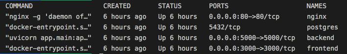

2. 在瀏覽器網址輸入 [localhost:5000/docs](http://localhost:5000/docs#/) 開啟 API 文件


3. 透過 API 文件執行 `/db/init` 初始化 DB
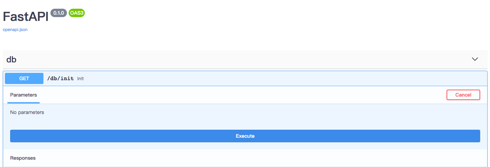

4. 在瀏覽器網址輸入 [localhost](http://localhost/) 開啟前端網頁

5. 預設帳號為 admin，密碼為 12345678，亦可點註冊頁面註冊新的帳號。


## 系統說明

### 前端 Frontend
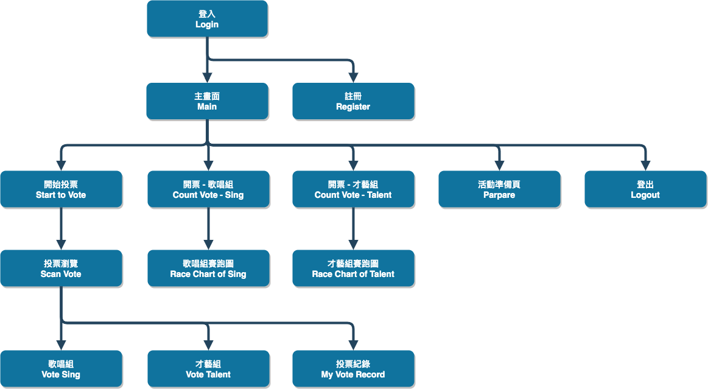

### 後端 Backend

#### db
- `/db/init`：即可創造資料表，在使用前必須先執行此步驟。

#### time
- `/time/change`：用來更改投票檢查點的時間，前端會分別顯示 「投票進行中」、「投票尚未開始」、「投票已結束」

#### login
- `/login`：登入

#### teams
- `/teams/get_menu`：依照 gid 拿取參賽隊伍資訊

#### vote
- `/vote/now`：拿 Server 的時間, datetime.now 為台灣時區 GMT 時間, 透過 timedelta + 8 個小時回傳給前端
- `/vote/who`：查詢投票給誰
- `/vote/vote`：用來投票，加上 token 可以增加安全性。
- `/vote/race`：提供開票的計算。
- `/vote/race/sing`：提供開票的計算(假資料)。
- `/vote/race/talent`：提供開票的計算(假資料)。
- `/vote/delete`：刪除投票。
- `/vote/download`：下載各組投票結果，計算各組的得票數。
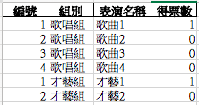

- `/vote/download2`：下載投票總覽，包含計算總票數、投票人數、歌唱組投票數、才藝組投票數。
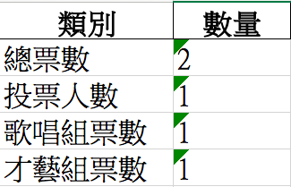

- `/vote/count`：計算投票數，可以用來自製長條圖(可以自行實作投票過程中查看長條圖的功能)。

### 資料庫 DB

#### Schemas
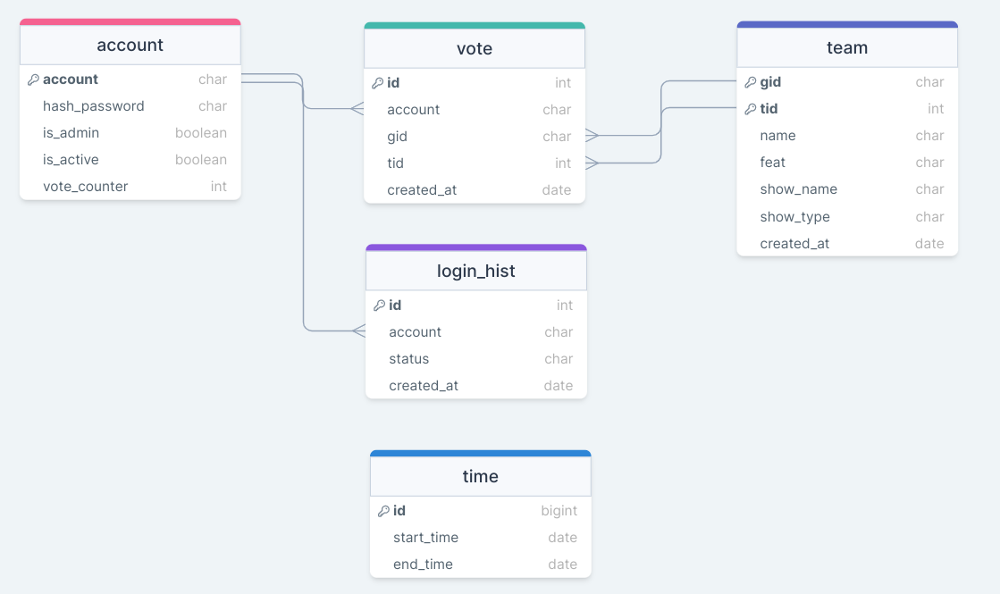

#### 連線至 DB 
1. docker exec -it {postgres CONTAINER ID} /bin/sh
2. psql -U postgres

## 部署正式環境
1. 設定負載平衡器，相關設定請參考 load_balance 資料夾。
2. 前端建立正式環境。 ```npm run build```
3. 利用 NGINX 渲染前端頁面，目錄設定在前端的 dist 資料夾。
4. 後端可根據您的使用情況設定一個或多個 IP 位置。
5. 設定 Cloud SQL。
6. 當您使用 ``` docker-compose -f ./docker-compose.yml up``` 建立容器時，請記得後端需調整 `SQLALCHEMY_DATABASE_URL` 設定為 Cloud SQL 的 IP，而前端需調整 `axios.defaults.baseURL` 以避免有 CORS 錯誤。

## 使用授權

著作權所有 (C) 2023  玉山商業銀行

本程式為自由軟體；您可依據自由軟體基金會所發表的GNU通用公共授權條款規定，就本程式再為散布與／或修改；無論您依據的是本授權的第二版或（您自行選擇的）任一日後發行的版本。

本程式係基於使用目的而加以散布，然而不負任何擔保責任；亦無對適售性或特定目的適用性所為的默示性擔保。詳情請參照GNU通用公共授權。

